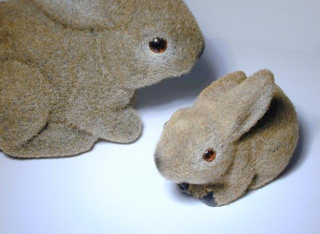
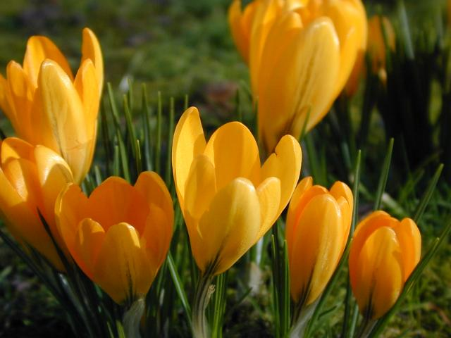
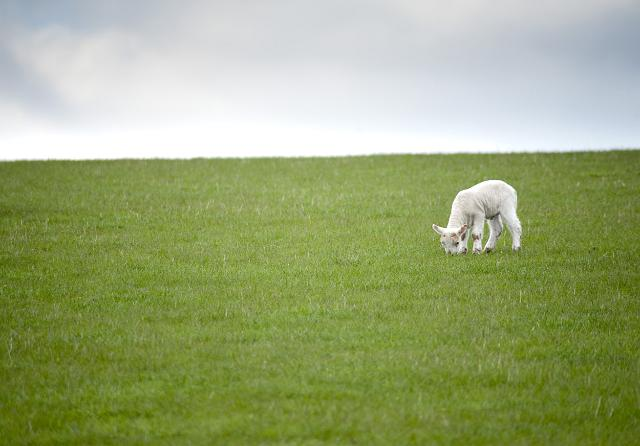

rotataDiz
=========

jquery plugin to create a 360 degree rotating carousel

==========================================================

How to use:

a) Include script in your page preferably before the end of body tag

	

b) Include the css file 

	<link href="css/style.css" rel="stylesheet" type="text/css"/>

c) place each images inside div having class 'eachBit'

	

		

		

		

		

		

		

	

d) call rotataDiz when dom is ready

	
	
options:

 1) autoPlay - whether you want the carousel to auto rotate or not (false by default, true for autorotate)
 2) circleRad - radius of circle
 3) transitionTime - default 1s , transition time between one movement

